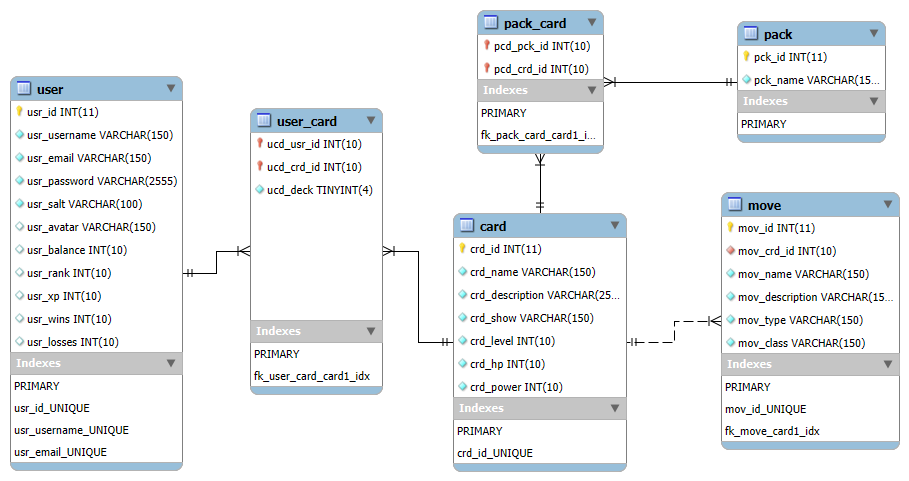

# Shounen Showdown (Anime Trading Card Game)

## Introduction

This is a web app I developed as part of a 3 man team for a client-server web application computing class. I was responsible for implementing a large porition of the website, including most of the frotend wireframes via react, the database via Maria DB, about half of the API routes via an express app, and a lot of the front end features with the exception fo the Battle and Shop pages. I also implemented the PWA capabilities such as installable app, caching, and offline caching.

# Proposal

## Problem Statement

Players in the Trading card game (TCG) community face challenges in accessibility, engagement, and affordability. Traditional TCGs require players to purchase and carry physical cards, limiting convenience and restricting play to in person gatherings. Digital alternatives exist but often include pay-to-win features, still making them inaccessible for certain users. Anime fans and TCG players seek an intuitive, digital platform where they can collect, trade, and battle with their favorite anime characters without the constraints of physical cards or predatory pay-to-win mechanics.

Our PWA aims to solve this problem by focusing on fair competition. Players will only be able to use cards that they have earned through our in-game battle and currency system. By combining the excitement of anime-themed card battles with a user-friendly and accessible platform, we empower players to enjoy a balanced, engaging, and dynamic TCG experience.

## Feature Description
This Trading Card Game (TCG) web app will feature user authentication, allowing users to create an account, log in, and log out. Once authenticated, users will be directed to the home page, where they can access various features:

- **Settings:** Edit personal details and log out.
- **Shop:** Purchase individual cards or card packs.
- **Deck & Collection:** Manage and customize deck.
- **Battle Modes:** Engage in offline and online battles.

### Settings
Users will be able to:
- Access **settings and logout options**.
  - Edit user data (username, email, password).
  - Log out of their account.

### Deck & Collection
- **Deck Management:**
  - Select cards to form a deck.
  - The deck must total **5 levels**.
- **Card Collection:**
  - View all collected cards categorized by **levels 1-5**.
  - Inspect card details and descriptions.

### Battle System
Users will engage in **1v1 battles**, each bringing a deck totaling **5 levels**. 
- The user with the **lowest total level** starts. If tied, the next lowest level is checked. If fully tied, the first turn is randomized.
- Battles are **turn-based**, with each player attacking with their full deck before the opponent.
- Attack Phase:
  - Choose an **attacking card** and an **attack move**.
  - Select an **opponent's card** to attack.
- Defense Phase:
  - The opponent selects a **defense option** for the attacked card.
  - Card type interactions affect **damage calculation**.
- Rounds continue until one player has **no remaining cards with HP**.

### Game Modes
#### **Online Mode** (PvP)
- Battle against an **active user**.
- **Rewards:** XP + in-game currency.
- **Winning:** Gain **trophies/RP**.
- **Losing:** Lose **trophies/RP**.

#### **Offline Mode** (PvE)
- Battle against a **bot**.
- **Rewards:** XP + in-game currency.

## PWA Capabilities
- Cross-Platform Accessibility: Players will be able to access the app on any device which removes the need for platform-specific app stores
- Offline Functionality: When the user is not connected to the internet, they can still build, strategize, and review their decks and play battles with the computer to gain XP
- Push Notifications: Users can be notified for different things such as - 
  - Daily Rewards and in-game achievements pop ups that keep the user engaged (Example: Winning your First Battle +50XP)
  - In-Game pop ups for informing “Player’s Turn” and “Enemy’s Turn”

## Wireframes

### Mobile View

### Desktop View

## Sources of Data Needed

The data we need for our application comes in two main categories. The first is data associated with user accounts. This data will either be obtained from the user when they create their account or added to update when the user completes battles (wins, losses, XP, rank, balance), opens card packs (current deck, balance), or modifies their current deck (current deck). The second is data associated with character cards. This is data that we will be sourcing from popular anime or creating ourselves based off of the game mechanics we want to implement. 

* User Accounts
    * ID
    * Username
    * Email
    * Password
    * Balance
    * Rank/Trophies
    * XP
    * Wins
    * Losses
    * Owned Cards
    * Current Deck
* Character Cards
    * ID
    * Name
    * Image
    * Level
    * HP
    * Power
    * Moves
        * ID
        * Name
        * Description
        * ATK/DEF
        * Type

# Final Product

## Progress Report

### Completed Features

* Login Page
  - Basic HTML, CSS, and Responsive Design
  - User can see if form data is valid
  - User can login to their account
* Register Page
  - Basic HTML, CSS, and Responsive Design
  - User can see if form data is valid
  - User can create an account
* Home Page
  - Basic HTML, CSS, and Responsive Design
  - User can select offline / online battle to begin a battle
  - User can see current deck before they begin a battle (dynamic loading)
  - User can see their user name
  - User can see their profile photo (dynamic loading)
* Profile Page
  - Basic HTML, CSS, and Responsive Design
  - User can see their username (dynamic loading)
  - User can see their battle stats (dynamic loading)
  - User can see their profile photo (dynamic loading)
* Settings Page
  - Basic HTML, CSS, and Responsive Design
  - User can see their username and email (dynamic loading)
  - User can update their username and email 
  - Back end form validation
  - User can update their profile photo (set up multer)
* Deck & Collection Page
  - Basic HTML, CSS, and Responsive Design
  - User can view their current deck (dynamic loading)
  - User can select view details about a specific card (dynamic loading)
  - User can view their current collection (dynamic loading)
  - User can edit their current deck from cards in their collection 
* Shop Page
  - User can view card packs (dynamic loading)
  - User can select view details about cards in pack (dynamic loading)
  - User can buy card packs which subtracts there balance and adds a card to their collection
  - User can see what card they unlocked after opening a pack
* Battle Page
  - User can battle the computer with higher intelligence
  - User can battle another user online
  - User can win or lose after all cards of a player are defeated
  - User can increase their xp and balance upon game completion
  - User can decrease their rank if they lose and increase rank if they win
  - Responsive Design

### Known Issues & Limitations

* If a user has not cached certain requests (cards, moves) they can not view them offline. This is currently causing issues with the battle mode.
* Put requests while offline do not update cache API values, so if you navigate to another page it will not persist until the user goes back online
* Current issues with connecting users to websockets online

## Authentication & Authorization

We use JWT authentication to authenicate users, and authorize all API routes with middleware except /login, /register, and /current. The user object is always sanitized when its returned to the user. Users can retrieve any data from users, like you could on a profile, but it is sanitized so the salts and passwords and other sensitive information is removed. Requests that edit a users information are verified on the backend that logged in user matches the person they are trying to edit, otherwise it will be rejected with a not authorized error.

## PWA Capabilities

* App is installable onto and usuable from your desktop
* Network first caching strategy for API calls
* Cache first strategy for non-API calls
* Put requests (such as update deck, battle results) are stored with IndexedDB when offline
* Put requests are loaded and set when the user goes back online

Method | Route                          | Description
------ | ------------------------------ | ---------
`POST` | `/login`                       | Receives an email and password
`POST` | `/logout`                      | Log out the current user
`POST` | `/register`                    | Creates a new user account and returns the new user object
`GET`  | `/current`                     | Gets the currently logged in user
`GET`  | `/users/:userId`               | Retrieves a user by its Id
`PUT`  | `/users/:userId`               | Updates user settings by its Id
`GET`  | `/cards`	                      | Gets all cards from database
`GET`  | `/cards/:cardId`	              | Gets card details by card ID
`GET`  | `/cards/:cardId/moves`	        | Gets all moves for a card by card ID
`GET`  | `/moves/:moveID`               | Gets move for card by move ID
`GET`  | `/users/:userId/cards`	        | Gets card collection for user by user ID
`POST` | `/users/:userId/cards`	        | Adds new cards to a users collection and retuns card collection object
`GET`  | `/packs`	                      | Gets all card packs
`GET`  | `/packs/:packId/cards`	        | Gets a random card from the selected pack that the user does not possess
`GET`  | `/users/:userId/decks`	        | Gets all cards in a users deck by user ID
`PUT`  | `/users/:userId/decks`	        | Updates a users deck and returns cards in deck as object

## Database ER Diagram

